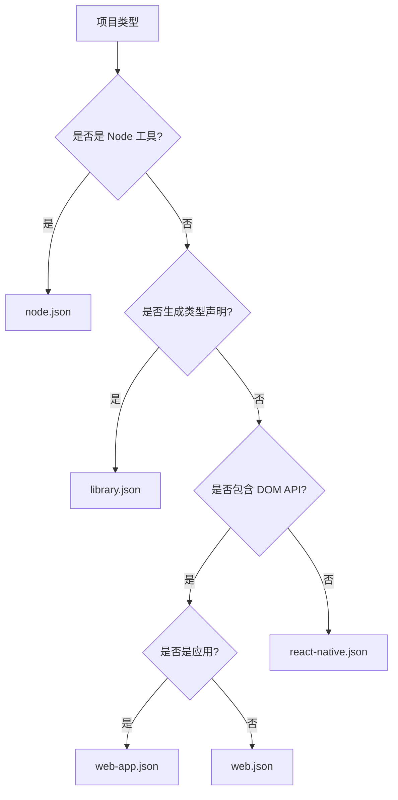

# @skyroc/tsconfig

> 共享的 TypeScript 配置包 - 统一编译配置

## 📦 包信息

- **包名**: `@skyroc/tsconfig`
- **版本**: `1.0.0`
- **平台**: Universal
- **依赖**: 无
- **位置**: `internal/tsconfig/`

## 🎯 职责定位

**核心职责**:
- 提供统一的 TypeScript 编译器配置
- 支持多种项目类型（库、应用、Node 工具）
- 支持跨平台开发（Web + React Native）
- 确保类型安全和代码质量

**设计原则**:
- 严格的类型检查
- 模块化配置继承
- 平台差异化处理
- 零依赖

## 📐 配置文件结构

```
@skyroc/tsconfig/
├── base.json              # 基础配置（所有配置的基类）
├── library.json           # 库包配置（生成类型声明）
├── node.json             # Node.js 工具配置
├── web.json              # Web 包配置
├── web-app.json          # Web 应用配置
├── react-native.json     # React Native 配置
├── package.json          # 包清单
└── README.md             # 使用文档
```

## 🔌 配置层次结构

```
base.json (基础配置)
├── library.json (库包)
├── node.json (Node 工具)
├── web.json (Web 包)
│   └── web-app.json (Web 应用)
└── react-native.json (React Native)
```

## 🔨 核心实现

### 1. base.json - 基础配置

所有配置的基类，包含严格的类型检查和模块设置：

```json
{
  "$schema": "https://json.schemastore.org/tsconfig",
  "display": "Base",
  "compilerOptions": {
    "target": "ESNext",
    "module": "ESNext",
    "moduleResolution": "bundler",
    "moduleDetection": "force",

    // 严格模式
    "strict": true,
    "strictNullChecks": true,
    "noImplicitAny": true,
    "noUncheckedIndexedAccess": true,
    "noUnusedLocals": true,
    "noUnusedParameters": true,

    // 模块处理
    "esModuleInterop": true,
    "allowSyntheticDefaultImports": true,
    "isolatedModules": true,
    "verbatimModuleSyntax": true,

    // 输出配置
    "noEmit": true,
    "skipLibCheck": true,
    "resolveJsonModule": true
  },
  "exclude": ["**/node_modules/**", "**/dist/**", "**/.turbo/**"]
}
```

**关键特性**:
- `noUncheckedIndexedAccess`: 索引访问返回 `T | undefined`，防止运行时错误
- `verbatimModuleSyntax`: 严格的 import/export 语法，type-only imports 必须使用 `import type`
- `isolatedModules`: 确保每个文件可独立编译（Vite/tsdown 要求）

### 2. library.json - 库包配置

用于 `packages/` 下的库包，需要生成类型声明：

```json
{
  "$schema": "https://json.schemastore.org/tsconfig",
  "display": "Library Package",
  "extends": "./base.json",
  "compilerOptions": {
    "jsx": "react-jsx",
    "lib": ["ESNext"],
    "declaration": true,
    "declarationMap": true,
    "noEmit": false,
    "emitDeclarationOnly": true
  }
}
```

**适用场景**:
- `@skyroc/core-*` 核心包
- `@skyroc/web-*` Web 包（库形式）
- `@skyroc/adapter-*` 适配器包
- `@skyroc/feature-*` 功能包

**编译流程**:
```bash
# TypeScript 只生成 .d.ts 类型声明
tsc --emitDeclarationOnly

# tsdown 或其他工具编译 JS
tsdown src/index.ts
```

### 3. node.json - Node 工具配置

用于 `internal/` 下的 Node.js 工具包：

```json
{
  "$schema": "https://json.schemastore.org/tsconfig",
  "display": "Node Config",
  "extends": "./base.json",
  "compilerOptions": {
    "lib": ["ESNext"],
    "moduleResolution": "node",
    "types": ["node"]
  }
}
```

**适用场景**:
- `internal/uno-config` UnoCSS 配置
- 构建工具
- 脚本工具

### 4. web.json - Web 包配置

用于 Web 专用包：

```json
{
  "$schema": "https://json.schemastore.org/tsconfig",
  "display": "Web Package",
  "extends": "./base.json",
  "compilerOptions": {
    "jsx": "react-jsx",
    "lib": ["ESNext", "DOM", "DOM.Iterable"],
    "useDefineForClassFields": true,
    "moduleResolution": "bundler",
    "types": ["vite/client"],
    "declaration": false
  }
}
```

**关键特性**:
- 包含 DOM 类型库
- Vite 客户端类型
- `react-jsx` JSX 模式（自动引入 React）

**适用场景**:
- `@skyroc/web-router`
- `@skyroc/web-table`
- `@skyroc/web-form`
- `@skyroc/web-layouts`

### 5. web-app.json - Web 应用配置

用于 Web 应用（`apps/admin`）：

```json
{
  "$schema": "https://json.schemastore.org/tsconfig",
  "display": "Web Application",
  "extends": "./web.json",
  "compilerOptions": {
    "types": ["vite/client"],
    "paths": {
      "@/*": ["./src/*"]
    }
  }
}
```

**适用场景**:
- `apps/admin`
- 其他 Vite 应用

### 6. react-native.json - React Native 配置

用于 React Native 应用和跨平台包：

```json
{
  "$schema": "https://json.schemastore.org/tsconfig",
  "display": "React Native",
  "extends": "./base.json",
  "compilerOptions": {
    "jsx": "react-jsx",
    "lib": ["ESNext"],
    "moduleResolution": "node",
    "types": ["react-native"],
    "declaration": false
  }
}
```

**关键差异**:
- 使用 `node` 模块解析（React Native Metro 要求）
- 不包含 DOM 类型
- 包含 React Native 类型

## 💡 使用示例

### 示例 1: 核心库包

```json
// packages/core-auth/tsconfig.json
{
  "extends": "@skyroc/tsconfig/library.json",
  "compilerOptions": {
    "rootDir": "./src",
    "outDir": "./dist"
  },
  "include": ["src/**/*"],
  "exclude": ["src/**/*.test.ts", "src/**/__tests__"]
}
```

### 示例 2: Web 专用包

```json
// packages/web-router/tsconfig.json
{
  "extends": "@skyroc/tsconfig/web.json",
  "include": ["src/**/*"]
}
```

### 示例 3: Web 应用

```json
// apps/admin/tsconfig.json
{
  "extends": "@skyroc/tsconfig/web-app.json",
  "compilerOptions": {
    "baseUrl": ".",
    "paths": {
      "@/*": ["./src/*"],
      "@skyroc/core-*": ["../../packages/core-*/src"],
      "@skyroc/web-*": ["../../packages/web-*/src"]
    }
  },
  "include": [
    "src/**/*",
    "vite.config.ts"
  ],
  "references": [
    { "path": "../../packages/core-auth" },
    { "path": "../../packages/core-theme" },
    { "path": "../../packages/web-router" }
  ]
}
```

### 示例 4: React Native 应用

```json
// apps/mobile/tsconfig.json
{
  "extends": "@skyroc/tsconfig/react-native.json",
  "compilerOptions": {
    "baseUrl": ".",
    "paths": {
      "@/*": ["./src/*"],
      "@skyroc/core-*": ["../../packages/core-*/src"]
    }
  },
  "include": ["src/**/*", "index.js", "App.tsx"]
}
```

### 示例 5: Node 工具

```json
// internal/uno-config/tsconfig.json
{
  "extends": "@skyroc/tsconfig/node.json",
  "compilerOptions": {
    "outDir": "./dist"
  },
  "include": ["src/**/*"]
}
```

## 🎨 配置选择决策树



**简化规则**:
1. **Node 工具** → `node.json`
2. **库包（需要 .d.ts）** → `library.json`
3. **Web 应用** → `web-app.json`
4. **Web 包** → `web.json`
5. **React Native** → `react-native.json`

## 🔄 迁移步骤

### 1. 更新 pnpm-workspace.yaml

确保包含 `internal/*`：

```yaml
packages:
  - apps/*
  - packages/*
  - internal/*
```

### 2. 迁移现有包

**核心包迁移**:
```bash
# packages/core-auth/tsconfig.json
cat > packages/core-auth/tsconfig.json << 'EOF'
{
  "extends": "@skyroc/tsconfig/library.json",
  "include": ["src/**/*"],
  "exclude": ["src/**/*.test.ts"]
}
EOF
```

**Web 包迁移**:
```bash
# packages/web-router/tsconfig.json
cat > packages/web-router/tsconfig.json << 'EOF'
{
  "extends": "@skyroc/tsconfig/web.json",
  "include": ["src/**/*"]
}
EOF
```

**应用迁移**:
```bash
# apps/admin/tsconfig.json
cat > apps/admin/tsconfig.json << 'EOF'
{
  "extends": "@skyroc/tsconfig/web-app.json",
  "compilerOptions": {
    "paths": {
      "@/*": ["./src/*"]
    }
  },
  "include": ["src/**/*", "vite.config.ts"]
}
EOF
```

### 3. 验证配置

```bash
# 检查类型错误
turbo run typecheck

# 单独检查某个包
cd packages/core-auth && tsc --noEmit
```

## 🧪 测试策略

### 1. 配置验证

```bash
# 验证配置文件格式
npx @schemastore/tsconfig internal/tsconfig/*.json
```

### 2. 类型检查测试

```bash
# 测试严格模式是否生效
# 在测试文件中故意写错误代码
const test: string = 123 // 应该报错
const arr = [1, 2, 3]
const item = arr[10] // 应该是 number | undefined
```

### 3. 跨包引用测试

```typescript
// 测试路径别名是否正确
import { useAuth } from '@skyroc/core-auth'
import { router } from '@skyroc/web-router'
```

## 📝 编译器选项详解

### 严格模式选项

| 选项 | 作用 | 示例 |
|-----|------|------|
| `strict` | 启用所有严格检查 | - |
| `strictNullChecks` | null/undefined 检查 | `let x: string = null` ❌ |
| `noImplicitAny` | 禁止隐式 any | `function fn(x) {}` ❌ |
| `noUncheckedIndexedAccess` | 索引返回可选类型 | `arr[0]` → `T \| undefined` |

### 模块选项

| 选项 | 值 | 说明 |
|-----|---|------|
| `module` | `ESNext` | 使用最新 ES 模块 |
| `moduleResolution` | `bundler` / `node` | bundler 用于 Vite，node 用于 RN |
| `verbatimModuleSyntax` | `true` | type-only imports 必须用 `import type` |

### 代码质量选项

| 选项 | 作用 |
|-----|------|
| `noUnusedLocals` | 检查未使用的局部变量 |
| `noUnusedParameters` | 检查未使用的参数 |
| `noFallthroughCasesInSwitch` | switch 必须有 break |
| `noImplicitOverride` | 重写方法必须用 `override` |

## 🎯 最佳实践

### 1. 类型导入

使用 `import type` 进行 type-only 导入：

```typescript
// ✅ 正确
import type { User } from './types'
import { fetchUser } from './api'

// ❌ 错误（verbatimModuleSyntax: true 会报错）
import { User, fetchUser } from './types'
```

### 2. 索引访问

始终检查索引访问的结果：

```typescript
// noUncheckedIndexedAccess: true
const arr = [1, 2, 3]
const item = arr[0] // type: number | undefined

// ✅ 正确
if (item !== undefined) {
  console.log(item * 2)
}

// ❌ 错误
console.log(item * 2) // Error: 可能是 undefined
```

### 3. 路径别名

在应用级别配置，不在库包：

```json
// ✅ apps/admin/tsconfig.json
{
  "compilerOptions": {
    "paths": {
      "@/*": ["./src/*"]
    }
  }
}

// ❌ packages/core-auth/tsconfig.json
// 不要在库包中配置 paths
```

### 4. 跨平台包

跨平台包不要依赖 DOM 类型：

```typescript
// ❌ 错误 - 在核心包中使用 DOM API
export function useLocalStorage() {
  return window.localStorage // Error: window 不存在
}

// ✅ 正确 - 使用抽象层
export function useStorage(adapter: StorageAdapter) {
  return adapter.get('key')
}
```

## 🔗 相关文档

- [TypeScript 编译选项](https://www.typescriptlang.org/tsconfig)
- [Vite TypeScript 支持](https://vitejs.dev/guide/features.html#typescript)
- [React Native TypeScript](https://reactnative.dev/docs/typescript)
- [包拆分架构](../../../PACKAGE_SPLIT_ARCHITECTURE.md)

## 📋 待补充内容

- [ ] Project References 配置示例
- [ ] Composite 模式的使用场景
- [ ] 增量编译优化
- [ ] monorepo 类型检查性能优化
- [ ] 自定义 TypeScript 插件集成

---

**最后更新**: 2026-01-25
**维护者**: 项目团队
